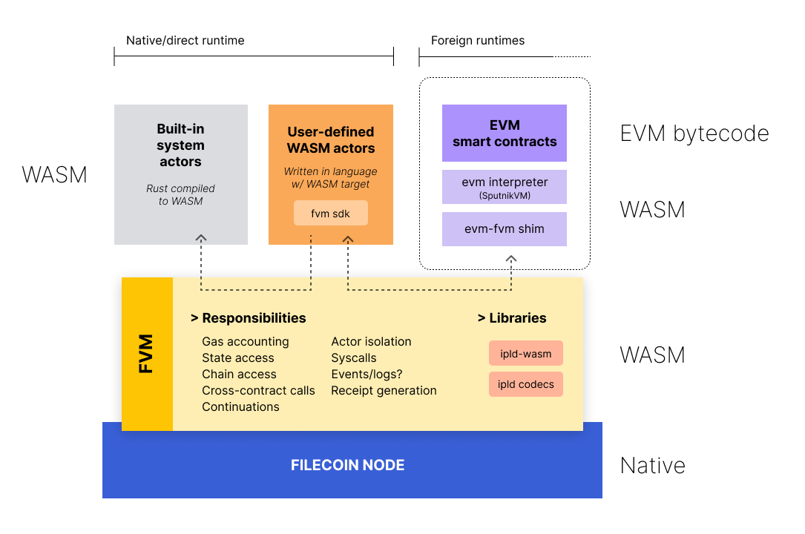

# Filecoin VM technical architecture

<!-- START doctoc generated TOC please keep comment here to allow auto update -->
<!-- DON'T EDIT THIS SECTION, INSTEAD RE-RUN doctoc TO UPDATE -->
**Table of Contents** 

- [Introduction](#introduction)
  - [Filecoin implementations](#filecoin-implementations)
- [Current VM](#current-vm)
- [Direction](#direction)
  - [Motivations](#motivations)
  - [Requirements](#requirements)
  - [Risks](#risks)
- [Proposed architecture overview](#proposed-architecture-overview)
- [WASM at the core](#wasm-at-the-core)
- [Data layer](#data-layer)
  - [IPLD foundation](#ipld-foundation)
  - [State access](#state-access)
  - [Chain access](#chain-access)
  - [Store](#store)
  - [Garbage collection](#garbage-collection)
- [Embedded actors](#embedded-actors)
- [Syscalls](#syscalls)
- [Calling conventions](#calling-conventions)
- [Gas accounting](#gas-accounting)
- [Actor deployment](#actor-deployment)
- [Libraries, packages, linking](#libraries-packages-linking)
- [Foreign runtime: EVM](#foreign-runtime-evm)
- [Cross-runtime calls](#cross-runtime-calls)
- [Upgradability](#upgradability)
- [Bridging other networks](#bridging-other-networks)
- [Formal verifiability](#formal-verifiability)

<!-- END doctoc generated TOC please keep comment here to allow auto update -->

## Introduction

The existing Virtual Machine (VM) in the Filecoin system acts as the execution environment for code deployed on-chain in the form of _Actors_. Actors are the Filecoin-equivalent of what the industry calls _"smart contracts"_.

Today's system revolves around a predefined set of [built-in system actors](https://spec.filecoin.io/#section-systems.filecoin_vm.sysactors). Collectively, these actors implement Filecoin-specific behaviour, such as storage provider management, sector tracking, protocol rewards, power accounting, storage markets, etc.

There's just one problem: users are unable install and run new _actor_ types. This results in Filecoin lacking general programmability.

This document specifies the proposed design for the FVM: a revision of the VM subsystem of the Filecoin network in order to enable the deployment of user-defined smart contracts and applications to the Filecoin network.

### Filecoin implementations

For the purposes of this document, we consider four Filecoin node implementations:

1. [Lotus](https://github.com/filecoin-project/lotus) (written in Go; reference implementation), own actors implementation.
2. [Forest](https://github.com/ChainSafe/forest) (written in Rust), own actors implementation.
3. [Venus](https://github.com/filecoin-project/venus) (written in Go; former go-filecoin implementation), reuses Lotus actors via go import.
4. [Fuhon](https://github.com/filecoin-project/cpp-filecoin) (written in C++), reuses Lotus actors via FFI.

## Current VM

This section provides a light summary of the core concepts, abstractions, and structure surrounding the existing VM. We expect a significant portion of these abstractions and structures to carry over to the FVM.

The term _Actor_ is a reference to the [actor model](https://en.wikipedia.org/wiki/Actor_model), a concurrent computation paradigm that inspires Filecoin's runtime and scalability primitives.

Actors operate on the state tree. Nothing else can modify the state tree in normal circumstances, other than actor logic. The single exception is state migration logic during a network upgrades. It can conduct bulk modifications, both to the content and the structure of the state tree.

The state tree is an IPLD object, containing the root of an [HAMT](https://ipld.io/specs/advanced-data-layouts/hamt/spec/#appendix-filecoin-hamt-variant) which in turn contains all actors, keyed by ID address.

Each actor has a type (represented by a CID), and a state root. The VM enforces actor state isolation, thus actors are prevented from accessing each other states.

Message passing is used to communicate between actors, even when simple state accesses are required. Mutations to state may only be applied within transactions.

Actor code is triggered through _messages_. Messages can be:

1. explicit: on-chain messages, leading to a _message receipt_ posted on chain as the result.
2. internal: between actors while processing a chain message, or triggered by a system event such as cron ticking.

Read more about the [structure of messages](https://spec.filecoin.io/#section-systems.filecoin_vm.message.message-syntax-validation).

Messages specify the actor method to invoke. Actors supply a method export table to the environment, and the VM performs method dispatch. This model will be revisited with the FVM, likely moving to actors exposing a single entrypoint, and dispatching internally with the assistance an SDK library.

Actor invocations are entirely synchronous. Actors can register entries in the cron actor, to schedule deferred execution at future epochs. Asynchronous calls are a desire of the upcoming FVM implementation, but not an immediate priority.

## Direction

### Motivations

1. **Profilteration of innovative solutions in user space.** Giving users the ability to program new behaviours on top of the existing Filecoin primitives will unlock degrees of freedom, potential for innovation, and composability/stacking of primitives to form innovative solutions in a DeFi fashion.
2. **Lower dependence on system actor evolution.** Features that would otherwise require changes to system actors could now be implemented in a trustless manner in user space.
3. **Unlocking layer 2 solutions.** Currently layer 2 solutions can only exist as sidechains, but it's impossible to create 
5. **Universally executable spec / "Code is Law".** A single version of system actors running in a deterministic environment enables all clients to univocally arrive to consensus. (Counterpoint: This also poses some risks)
6. **Quicker protocol evolution.** Protocol upgrades can be implemented once. Rollout of FIPs will no longer bottleneck on finishing implementation across clients. Less coordination needed across implementers.
7. **Basis for computation-over-data.** There's good reason to believe that IPLD-ready WASM-based VMs are a useful stepping stone to enable computations
8. **Enabling governance-driven automatic protocol upgrades**. As more elements of the Filecoin protocol migrate to WASM space (e.g. block validation, fork choice rule, etc.), it becomes possible to deploy protocol changes as WASM modules to all clients, conditional upon on-chain voting.

### Requirements

1. Must support multiple VM runtimes, making it possible to deploy EVM bytecode (contracts likely written in Solidity) with full execution parity in 95% of cases, as well as contracts written natively and specifically for Filecoin.
2. Must enable interfacing seamlessly with built-in system actors.
3. Must support calls across contracts targeting different VM runtimes.
4. Must support synchronous calls, and should eventually support asynchronous calls.
6. Must be IPLD-native, handling all IPLD access patterns efficiently.
7. Must track reachability of IPLD objects upon state mutations to prevent indiscriminate state growth.
8. Must account for real computation costs (high-fidelity gas metering).
9. User code must not prevent system messages from executing (TBD).
10. Should support formalising interface contracts (methods, arguments, return values) with IPLD schemas.
11. Must be simple and enjoyable to use.

### Risks

1. **State size.** Without rent/expiration, gas will need to be carefully tuned to avoid a further explosion of state size. Furthermore, consideration will have to be taken for state expiration (or we'll have to design for it up-front?.
2. **Chain bandwidth.** Without sharding, we'll likely need to implement multiple "lanes" (as we've discussed before) to ensure that user actors don't clog necessary traffic like deal making.
3. **Performance degradation.** If we compile our actors to WASM, execution time could increase.

## Proposed architecture overview

## WASM at the core

<!-- Hypervisor abstraction, native runtime, Wasmer vs. Wasmtime -->

## Data layer

### IPLD foundation

<!-- ipld-wasm library, codecs, selectors -->

### State access

### Chain access

### Store

<!-- avoiding excessive boundary costs -->

### Garbage collection

## Embedded actors

## Syscalls

## Calling conventions

<!-- single entrypoint; sync only; future async; parallel execution; IPLD schemas -->

## Gas accounting

## Actor deployment

## Libraries, packages, linking

## Foreign runtime: EVM

<!-- memory model, storage model, address schema translation, gas metering, logs/events, call opcodes -->

## Cross-runtime calls

## Upgradability

<!-- at different layers, incl. evm shim -->

## Bridging other networks

## Formal verifiability